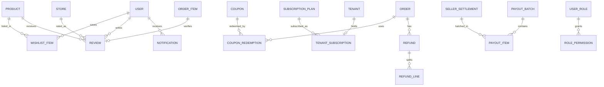

# MarketHub — Phase 2 Technical Specification (Growth Platform)

## 1. Executive Summary

Phase 2 turns the Phase 1 core marketplace into a revenue and trust platform: automated seller payouts, a configurable commissions engine, coupons, verified reviews, wishlist, in-app notifications, SaaS subscription plans, partial refunds, and seller staff RBAC. Delivery remains seller-fulfilled; platform-managed logistics stays optional.

**Depends on:** Phase 1 tenancy, master/child orders, payment gateway interface, Sanctum API, Angular role dashboards.

**Still out of scope (Phase 3+):** custom domains / branded storefronts, native mobile apps, multi-currency + FX, analytics warehouse, advertising exchange, warehouse multi-location inventory.

---

## 2. Scope & Assumptions

| # | In scope | Notes |
|---|---|---|
| S1 | Reviews & ratings (product + store), moderation, report/flag | Verified-purchase only |
| S2 | Wishlist / favorites | Customer-scoped; public counts optional |
| S3 | Coupon engine | Platform + tenant coupons; cart/checkout apply |
| S4 | Commissions engine | Per-category / per-tenant rates, min/max, overrides |
| S5 | Seller payouts automation | Batch release of pending settlements |
| S6 | SaaS subscription plans | Limits: stores, SKUs, staff seats, storage |
| S7 | Partial refunds | Line-level, settlement adjustment, gateway refund |
| S8 | Notifications | In-app inbox + email (queue); order/review/payout events |
| S9 | Seller staff RBAC | store_manager, sales, inventory, accountant |
| S10 | Featured listings (manual) | Admin/tenant flags already in Phase 1; add paid window |

| # | Assumption | Trade-off if wrong |
|---|---|---|
| B1 | Single currency still (USD/GHS instance-level) | Multi-currency = Phase 3 |
| B2 | Payouts via same PaymentGateway `payout()` or manual export CSV if driver lacks it | Ghana PSP (Paystack/Hubtel) behind interface |
| B3 | Coupons cannot stack unless `stackable=true`; platform coupon applies after tenant coupon | Complexity vs conversion |
| B4 | Reviews only after `seller_order.status` in `delivered/completed` | Prevents fake verified reviews |
| B5 | Subscriptions billed monthly; grace 3 days then storefront unpublished | Hard cut vs grace |
| B6 | Partial refunds require remaining qty/amount >= 0; commission clawback proportional | Rounding to 2 dp |

---

## 3. Data Model (additive)



### Tables

| Table | Key fields | Constraints |
|---|---|---|
| `wishlist_items` | user_id, product_id | `UNIQUE(user_id, product_id)` |
| `reviews` | user_id, product_id, store_id, order_item_id NULL, rating 1-5, body, status (pending/published/rejected/flagged), verified bool | one review per user per product per order_item |
| `review_reports` | review_id, reporter_user_id, reason | |
| `coupons` | tenant_id NULL (platform), code, type (percent/fixed), value, min_subtotal, max_discount, starts_at, ends_at, usage_limit, per_user_limit, stackable, applies_to (order/store/category) | `UNIQUE(tenant_id, code)` |
| `coupon_redemptions` | coupon_id, user_id, order_id, amount | |
| `commission_rules` | tenant_id NULL, category_id NULL, rate, min_fee, max_fee, priority | highest priority wins |
| `subscription_plans` | name, slug, price_monthly, max_stores, max_skus, max_staff, featured_slots, status | admin-configurable |
| `tenant_subscriptions` | tenant_id, plan_id, status (trialing/active/past_due/cancelled), current_period_end, grace_until | one active per tenant |
| `refunds` | order_id, requested_by, approved_by, status (requested/approved/rejected/processed), amount, gateway_ref | |
| `refund_lines` | refund_id, order_item_id, qty, amount | qty <= remaining |
| `payout_batches` | status (draft/processing/paid/failed), scheduled_for, gateway, gateway_ref, total | |
| `payout_items` | batch_id, settlement_id, amount | settlement.status pending -> released |
| `notifications` | user_id, type, title, body, data JSON, read_at | index (user_id, created_at) |
| `permissions` / `role_permissions` | role, permission key | seed defaults per staff role |

Indexes: `reviews(product_id, status)`, `coupons(code, status)`, `notifications(user_id, read_at)`, `tenant_subscriptions(status, current_period_end)`.

---

## 4. REST API Surface (Phase 2)

Auth and error envelope unchanged from Phase 1 (RFC 7807-style, Sanctum).

| Area | Endpoint | Method | Authz |
|---|---|---|---|
| Wishlist | `/api/wishlist` GET; `/api/wishlist/{productId}` POST/DELETE | GET/POST/DELETE | customer |
| Reviews | `/api/market/products/{slug}/reviews` GET; `/api/reviews` POST; `/api/reviews/{id}/report` POST | GET public; POST customer verified | |
| Review mod | `/api/admin/reviews` list/patch status; `/api/tenant/reviews` list own | GET/PATCH | admin / tenant |
| Coupons | `/api/tenant/coupons` CRUD; `/api/admin/coupons` platform CRUD | CRUD | tenant / admin |
| Coupon apply | `/api/checkout/quote` accepts `coupon_code`; `/api/cart/coupon` POST/DELETE | POST | customer |
| Subscriptions | `/api/admin/plans` CRUD; `/api/tenant/subscription` GET; `/api/tenant/subscription/change` POST | | admin / tenant_owner |
| Refunds | `/api/orders/{id}/refunds` POST (customer/seller); `/api/admin/refunds/{id}` PATCH approve | POST/PATCH | owner / admin |
| Payouts | `/api/tenant/payouts` list; `/api/admin/payouts/run` POST; `/api/admin/payouts` GET | | tenant read / admin run |
| Notifications | `/api/notifications` GET; `/api/notifications/{id}/read` POST; `/api/notifications/read-all` POST | | token |
| Staff | `/api/tenant/staff` CRUD invite; `/api/tenant/staff/{id}/permissions` PATCH | | tenant_owner |
| Commissions | `/api/admin/commission-rules` CRUD | | super_admin |

**Checkout quote with coupon:**

```http
POST /api/checkout/quote
{ "shipping_address_id": 42, "coupon_code": "WELCOME10" }
```

Response totals add `discount_total` and `coupon: { code, amount }`. `grand_total` is after discount. Commission is computed on post-discount seller subtotal.

---

## 5. Domain Rules

### 5.1 Reviews

- Create allowed only if `order_item` belongs to the user and parent seller_order is `delivered` or `completed`.
- Default status `pending` if body contains links or rating is 1; else `published` (configurable).
- Product rating = avg published reviews; store rating = avg of its product reviews.
- Flagging 3 times auto-hides (`flagged`) until admin acts.

### 5.2 Coupons

Resolution order: tenant coupon (items of that store only) then platform coupon (remaining eligible subtotal). Reject if min_subtotal not met, expired, or usage_limit hit. Record redemption inside the checkout DB transaction.

### 5.3 Commissions

```
rate = first matching commission_rules by priority
  (tenant+category) > (tenant) > (category) > (platform default)
commission = clamp(subtotal * rate, min_fee, max_fee)
net = subtotal + delivery_fee - commission - refund_amount
```

Changing a rule does not rewrite historical seller_orders.

### 5.4 Partial refunds

- Request specifies `lines: [{ order_item_id, qty, amount? }]`; amount defaults to `qty * unit_price`.
- Restock optional flag; if true, increment inventory quantity.
- On `processed`: PaymentGateway.refund(tx, amount); bump `seller_settlements.refund_amount`; if settlement already `released`, create clawback payout_item (negative).
- Master order status: `partially_refunded` if remaining > 0 else `refunded`.

### 5.5 Payouts

Nightly job (or admin "Run payouts"): select settlements `pending` where seller_order in `delivered/completed` and `placed_at` older than hold period (default 7 days). Group by tenant, create `payout_batch`, call gateway or mark `export_csv`. Idempotent on `settlement_id`.

### 5.6 Subscriptions

On tenant register, attach default `starter` plan (trial 14 days). Enforce limits in product/store/staff create policies. `past_due` after period_end: storefront products hidden from `/api/market/*` until paid or grace ends, then stores set `suspended`.

### 5.7 Notifications (events)

| Event | Recipients |
|---|---|
| order.paid | customer, each seller owner |
| seller_order.status_changed | customer |
| review.published | seller |
| payout.paid | tenant_owner |
| subscription.past_due | tenant_owner |
| refund.processed | customer, seller |

Write `notifications` row + queued mail. Never include PII beyond order id in logs.

### 5.8 Staff RBAC

| Permission | Owner | Manager | Sales | Inventory | Accountant |
|---|---|---|---|---|---|
| products CRUD | yes | yes | read | read | — |
| inventory adjust | yes | yes | — | yes | — |
| fulfil orders | yes | yes | yes | — | read |
| coupons | yes | yes | — | — | read |
| payouts read | yes | — | — | — | yes |
| staff manage | yes | — | — | — | — |

---

## 6. Angular screens (Phase 2)

| Screen | Additions |
|---|---|
| Product detail | Stars, review list, write-review (if eligible), wishlist heart |
| Store page | Store rating, review summary |
| Cart / checkout | Coupon field, discount line, subscription-gated seller warning |
| Customer | Wishlist, notification bell, refund request on order detail |
| Seller | Coupons CRUD, reviews inbox, payout history, staff invites, plan usage meters |
| Super Admin | Plans, commission rules, payout run, review moderation queue, coupon platform |

Keep standalone components + signals, role guards, RFC7807 interceptor. WCAG 2.1 AA unchanged.

---

## 7. Jobs & ops

- `payouts:run` daily 02:00
- `subscriptions:tick` hourly (expire / grace / unpublish)
- `reviews:recompute-ratings` after publish/reject
- `notifications:prune` 90 days
- Hold period and commission default remain env/config: `PAYOUT_HOLD_DAYS`, `PLATFORM_COMMISSION_RATE`

---

## 8. Security additions

- Coupon brute-force throttle (`throttle:10,1` on apply)
- Review create throttle per user
- Payout run is super_admin only + audit log
- Staff invite tokens expire 48h; cannot grant super_admin
- Refund amount cannot exceed captured payment minus prior refunds
- Continue zero cross-tenant leakage tests for new endpoints

---

## 9. Delivery order

1. Wishlist + notifications inbox
2. Reviews (create, listing, moderation, ratings on product card)
3. Coupon apply on quote/checkout
4. Commission rules (replace flat config rate)
5. Partial refunds + settlement clawback
6. Payout batches
7. Subscription plans + limit enforcement
8. Seller staff roles
9. Admin screens + hardening tests

---

## 10. Success criteria

- A verified buyer can rate a product; average appears on marketplace cards.
- A customer can apply a valid coupon and see a reduced `grand_total`.
- Admin can change a tenant commission rate without rewriting old orders.
- Admin can run payouts; seller sees released settlements.
- Tenant on `starter` cannot exceed SKU cap.
- Partial refund restocks and reduces net settlement.
- Staff with `inventory` cannot open payouts.
