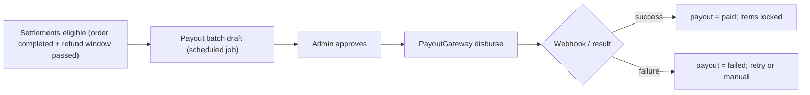

# MarketHub — Phase 2 Technical Specification (Monetization, Growth & Fulfilment)

## 1. Executive Summary

Phase 2 layers monetization (subscriptions, commissions, payouts), growth (reviews, coupons, notifications), and fulfilment/ops (delivery, reports, analytics) onto the Phase 1 core. It assumes the Phase 1 foundations: shared-DB `tenant_id` scoping, master order + seller child orders, payment gateway abstraction, and settlement records (`seller_settlements`) already exist.

## 2. Scope, Assumptions & Key Decisions

| # | Assumption | Trade-off if wrong |
|---|---|---|
| B1 | Subscriptions = tenants subscribing to **SaaS plans** (platform revenue), not customer memberships | If customer memberships needed: add `subscription` morph on users + per-store entitlement checks |
| B2 | Commission model: percentage + optional flat fee per order item, configurable **per store/tenant, with platform default** | Category-level commissions = Phase 3; refund reversals handled pro-rata on refunded lines |
| B3 | Payouts: platform-initiated batch payouts to sellers via a **PayoutGateway abstraction** (manual bank transfer is the MVP driver); payout schedule weekly/monthly with minimum threshold | Instant/on-demand payouts require per-gateway KYC integrations (Stripe Connect, etc.) |
| B4 | Coupons: platform-wide and store-scoped coupons, flat/percent, usage limits, min order value | Stacking coupons excluded from MVP |
| B5 | Delivery: sellers self-fulfil with **delivery providers abstracted** (own-driver tracking + external carrier API as drivers); delivery personnel module added | Platform-orchestrated 3PL dispatch changes the seller_order state machine |
| B6 | Notifications: email (transactional) + in-app + optional push; event-driven via domain events | SMS = config-level add |
| B7 | Reports/Analytics: operational reports from OLTP with read replicas/rollup tables; dedicated warehouse (Phase 3) | Heavy ad-hoc analytics will need OLAP later |
| B8 | Reviews: purchase-verified only, moderation queue | No Q&A, no photo reviews in MVP |

**Key decisions:**
1. **Money flows stay separated:** customer totals vs seller settlements vs platform commission vs delivery fees — never merge into one column.
2. **All Phase 2 state changes are event-driven** (`SellerOrderDelivered`, `PaymentCaptured`, …) so commissions, payouts, notifications, and analytics react without coupling.
3. **Payouts are immutable ledger entries** — never mutate settled amounts; corrections are new adjustment entries.

---

## 3. Data Model Additions

```mermaid
erDiagram
  PLAN ||--o{ SUBSCRIPTION : has
  TENANT ||--o{ SUBSCRIPTION : holds
  TENANT ||--o{ COMMISSION_RULE : configures
  SELLER_ORDER ||--o{ SELLER_SETTLEMENT : computes
  SELLER_SETTLEMENT ||--o{ PAYOUT_ITEM : groups
  PAYOUT ||--o{ PAYOUT_ITEM : contains
  PRODUCT ||--o{ REVIEW : receives
  USER ||--o{ REVIEW : writes
  COUPON ||--o{ COUPON_REDEMPTION : redeemed_via
  ORDER ||--o{ SHIPMENT : fulfills
  SELLER_ORDER ||--o{ SHIPMENT : fulfills
  NOTIFICATION ||}o--|| USER : targets
  DAILY_SALES_ROLLUP }o--|| TENANT : aggregates
```

| Table | Key fields | Notes / constraints |
|---|---|---|
| `plans` | id, name, price, billing_cycle (monthly/annual), limits JSON (max stores, max SKUs, commission override, features), status | platform-managed |
| `subscriptions` | id, tenant_id, plan_id, status (trialing/active/past_due/cancelled), current_period_start/end, gateway_customer_id, cancel_at_period_end | `UNIQUE(tenant_id, status='active')` enforced via partial unique + app guard |
| `subscription_invoices` | id, subscription_id, amount, status, paid_at, payment_transaction_id | reuses Phase 1 gateway abstraction |
| `commission_rules` | id, tenant_id NULL (platform default), store_id NULL, category_id NULL, pct, flat_fee, priority, active_at | resolution: store > tenant > platform default; effective-dated |
| `payouts` | id, tenant_id, period_start/end, gross, commission, refunds, adjustments, net, status (draft/approved/processing/paid/failed), gateway_ref, initiated_by, approved_by | two-person rule: initiator ≠ approver |
| `payout_items` | id, payout_id, seller_settlement_id, amount | `UNIQUE(seller_settlement_id)` — never paid twice |
| `payout_adjustments` | id, tenant_id, reason, amount ±, payout_id NULL | ledger-style corrections |
| `reviews` | id, product_id, user_id, order_item_id (verified purchase), rating 1–5, body, status (pending/published/rejected), moderated_by | `UNIQUE(order_item_id, user_id)`; one review per purchased item |
| `coupons` | id, owner (platform/store→tenant_id), code, type (percent/fixed), value, min_order_total, max_redemptions, per_user_limit, starts_at/ends_at, status | `UNIQUE(scope_tenant_id, code)`; code hashed or case-normalized |
| `coupon_redemptions` | id, coupon_id, order_id, user_id, discount_amount | `UNIQUE(coupon_id, order_id)` |
| `order_discounts` | order_id/seller_order_id, coupon_id NULL, amount, allocation_basis | **proportional allocation** of platform coupons across seller orders |
| `shipments` | id, seller_order_id, provider (own/carrier slug), tracking_number, status (label_created/picked_up/in_transit/delivered/failed), shipped_at, delivered_at, carrier_payload JSON | status machine mirrored from provider webhooks |
| `notification_preferences` | user_id, channel, event_type, enabled | per user/event/channel |
| `notifications` | id, user_id, event_type, title, body, data JSON, read_at, channels_sent | `UNIQUE(user_id, dedupe_key)` |
| `daily_sales_rollups` | tenant_id, store_id, date, orders_count, gross, commission, refunds, net | built by nightly job; indexes on (tenant_id, date) |
| `reports_jobs` | id, requested_by, tenant_id NULL (platform = all), type, params JSON, status, output_file_path | async CSV/PDF export, tenant-scoped |

Indexes: `reviews(product_id, status, created_at)`, `coupons(code, status, starts_at, ends_at)`, `payouts(tenant_id, status)`, `shipments(seller_order_id)`, `daily_sales_rollups(tenant_id, store_id, date)`.

---

## 4. State Machines & Flows

**Subscription lifecycle:** `trialing → active → past_due (dunning, 3 retries) → cancelled | expired`. Renewal via gateway charge on period end (scheduled job); failed charge ⇒ past_due ⇒ tenant read-only after grace (enforce via middleware checking subscription status).

**Commission computation (on `SellerOrderDelivered`):**
```
commission = Σ(order_items: gross_item × pct) + flat_fee(seller_order)
seller_settlement.net = gross − commission − allocated_delivery − allocated_discounts − refunds
```
Refunds reverse commission pro-rata and create negative adjustment entries — never edit historical settlements.

**Payout flow:**



**Delivery flow:** `SellerOrderPaid → awaiting_fulfillment → label_created → picked_up → in_transit → delivered` (carrier webhooks update `shipments`; delivered triggers commission + review window). Own-driver mode: seller marks shipped/delivered with proof-of-delivery upload (tenant-prefixed storage path).

---

## 5. API Additions

| Area | Endpoint | Method | Authz |
|---|---|---|---|
| Plans/Subs | `/api/admin/plans` CRUD; `/api/tenant/subscription` GET/POST/POST cancel | CRUD/GET/POST | super_admin / tenant_owner |
| Commissions | `/api/admin/commission-rules`, `/api/tenant/commission-rules` | CRUD | super_admin / tenant_owner (own) |
| Settlements | `/api/tenant/settlements` (list/detail, filter by period/status) | GET | tenant_owner |
| Payouts | `/api/admin/payouts` (list/draft/approve), `/api/admin/payouts/{id}/retry` | GET/POST | super_admin, two-person approval |
| Reviews | `/api/market/products/{id}/reviews` GET/POST (verified purchase), `/api/reviews/{id}` DELETE (author), `/api/admin/reviews` moderation | GET/POST/DELETE | public read / customer / super_admin |
| Coupons | `/api/tenant/coupons` CRUD, `/api/admin/coupons`; validation at checkout: `POST /api/cart/coupon` | CRUD/POST | tenant_owner / customer |
| Notifications | `/api/notifications` (list, mark-read), `/api/notifications/preferences` | GET/PATCH | any authed user |
| Delivery | `/api/tenant/orders/{id}/shipments` POST (label/tracking), `/api/webhooks/carrier/{provider}` | POST | tenant / public+signature |
| Reports | `/api/tenant/reports/{type}` GET (sync small) / POST export job; `/api/admin/reports` | GET/POST | role-scoped |
| Analytics | `/api/tenant/analytics/summary?from&to`, `/api/admin/analytics/overview` | GET | tenant / super_admin |

Idempotency: coupon application and shipment creation accept `Idempotency-Key`. Export jobs return `202 { job_id }` + download URL when ready (signed, 24h expiry).

**Coupon validation rules:** active window, per-user limit, min order total, max redemptions, tenant/store scope match; discount allocated across seller orders by line-share so settlements stay consistent.

---

## 6. Notifications

Event → channels matrix (MVP):

| Event | In-app | Email | Push (Phase 3) |
|---|---|---|---|
| Order placed / paid | ✅ seller+customer | ✅ | — |
| Order shipped / delivered | ✅ customer | ✅ | — |
| Refund processed | ✅ | ✅ | — |
| Subscription past_due / renewed | ✅ tenant owner | ✅ | — |
| Payout approved / paid | ✅ tenant owner | ✅ | — |
| Review needs moderation | — | ✅ admin | — |
| Low stock alert | ✅ seller | optional | — |

Implementation: domain events → `ShouldQueue` listeners → `NotificationDispatcher` honoring `notification_preferences`; all queued, retry-safe, deduped via `dedupe_key`.

---

## 7. Reports & Analytics

**Operational reports (from rollups/OLTP):** sales by store/period, commission summary, settlements & payouts ledger, refund rate, low-stock, coupon performance, delivery SLA (order→delivered time), review moderation queue stats.

**Tenant analytics dashboard:** GMV, net after commission, top products, order funnel (cart→checkout→paid), repeat-customer rate. **Admin analytics:** MRR/ARR from subscriptions, churn, GMV by store, commission yield, payout aging.

Pattern: nightly rollup job writes `daily_sales_rollups`; dashboard queries hit rollups (fast, cheap); anything older than 90 days flagged for warehouse migration (Phase 3). Exports are queued jobs writing tenant-prefixed files with signed URLs; **never** cross-tenant unless super_admin (audited).

---

## 8. RBAC Additions

| Capability | Super Admin | Tenant Owner | Store Staff | Customer |
|---|---|---|---|---|
| Manage plans, approve payouts, global commission rules | ✅ | — | — | — |
| Approve payouts (second person) | ✅ (≠ initiator) | — | — | — |
| View own settlements, own commission rules, tenant reports | — | ✅ | read | — |
| Create shipments, update own coupon set | — | ✅ | ✅ | — |
| Write review (verified purchase), manage own notification prefs | — | — | — | ✅ |
| Moderate reviews, platform coupons, platform-wide reports | ✅ | — | — | — |

---

## 9. Security & Correctness Risks (explicit)

- **Payout double-payment:** enforce `UNIQUE(payout_items.seller_settlement_id)` + DB transaction + settlement status lock; reconciliation job vs payout gateway ledger.
- **Coupon abuse:** server-side validation only, per-user caps, rate-limit `/cart/coupon`, idempotent application, audit trail of redemptions.
- **Subscription enforcement bypass:** middleware/tenant gate checks subscription status on *every* seller API request, not just at login.
- **Review authenticity:** verified via `order_item_id` ownership check; moderation before publish; rate-limit review creation.
- **Refund/commission race:** state transitions only via guarded transitions (e.g., `laravel-state-machine` style guards); commission reversal as new ledger entries, no mutation.
- **Carrier webhook spoofing:** signature verification + `webhook_events` idempotency (reuse Phase 1 pattern).
- **Analytics data leakage:** rollup queries scoped by tenant_id at query level, tested with negative authorization tests.
- Payout KYC/tax data (bank details) stored encrypted; masked in all API responses (e.g., `••••4821`).

---

## 10. Delivery Order (build sequence)

1. Commissions engine + settlement refinement (foundation for payouts) → 2. Subscriptions + enforcement middleware → 3. Payouts (manual transfer driver first) → 4. Coupons (checkout integration) → 5. Reviews → 6. Notifications infrastructure → 7. Shipments/delivery → 8. Rollups, reports, analytics dashboards → 9. Re-run Phase 1 hardening checklist against new endpoints.

---

Next artifact I can produce: full migration SQL for the Phase 2 tables, OpenAPI spec for payouts/settlements, or the payout two-person-approval sequence diagram. Which one — and confirm B1 (subscriptions = SaaS plans for tenants, not customer memberships) if that assumption matters to you.