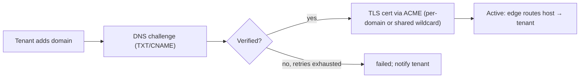
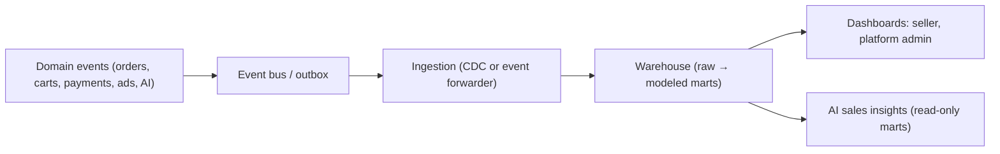
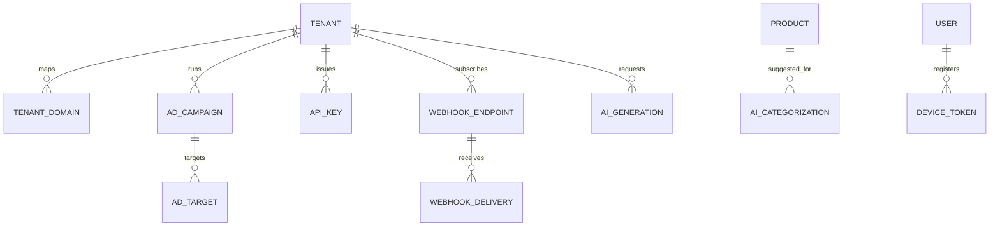

# MarketHub — Phase 3 Technical Specification (Scale, Distribution & Intelligence)

## 1. Executive Summary

Phase 3 adds tenant growth and platform intelligence: custom domains with automated TLS, mobile apps consuming the existing API, an analytics warehouse, an advertising platform, a public Seller API, outbound webhooks, and three AI capabilities (product descriptions, categorization, sales insights) behind a provider-agnostic AI abstraction. All features ride on Phase 1–2 foundations: tenant scoping, order/settlement model, payment & payout gateways, event-driven architecture.

## 2. Scope, Assumptions & Key Decisions

| # | Assumption | Trade-off if wrong |
|---|---|---|
| C1 | Custom domains: tenants map their own domain to their storefront; platform runs edge routing (reverse proxy/CDN) | SaaS-style app routing per tenant changes middleware design (host-based tenant resolution already assumed from A2) |
| C2 | Mobile app: single marketplace **customer** app (iOS/Android via one codebase, e.g., Flutter/React Native or Capacitor); seller mobile = Phase 3.5 decision | Native-per-platform doubles cost; Capacitor wraps Angular at lower polish |
| C3 | Advanced analytics: event pipeline → warehouse (e.g., BigQuery/Snowflake/ClickHouse) with dbt-style transforms; operational DB stays OLTP | Rollup-table-only analytics won't survive ad-hoc cohort/funnel queries at scale |
| C4 | Advertising: **sponsored product listings** (CPC + CPM hybrid), auction per search/category slot, platform-managed inventory | Self-serve ad dashboards for sellers = included; offsite ads excluded |
| C5 | Seller API: public, versioned REST (`/api/v1`), API-key or OAuth2 client-credentials auth per tenant | Public unauthenticated read APIs excluded |
| C6 | Webhooks: outbound, tenant-subscribed, HMAC-signed, at-least-once with retries | Sync "callback URLs" (no retry) are explicitly rejected as fragile |
| C7 | AI: provider-agnostic `AiProvider` abstraction; no vendor assumed; generated content is **draft-only** pending human review | Direct-to-publish generation increases moderation risk |

**Key decisions:**
1. **Host-based tenant resolution** becomes a first-class subsystem (domains table + edge routing) — it also cleanly supports the Phase 1 `slug` subdomain fallback.
2. **AI features share one gateway:** cost budgeting, prompt-tenant isolation, moderation, and caching live in one `AIGateway` service, not per-feature copies.
3. **Analytics warehouse is event-sourced from domain events** (Phase 2's events become the stream), avoiding dual-write logic in controllers.
4. **Seller API and outbound webhooks are the same integration platform:** same auth, same event catalog, same versioning/deprecation policy.

---

## 3. Custom Domains

**Domain lifecycle states:** `requested → dns_pending → verified → tls_provisioning → active → failed → removed`.



| Table | Key fields | Constraints |
|---|---|---|
| `tenant_domains` | id, tenant_id, domain, status, verification_token, dns_verified_at, cert_status, last_check_at | `UNIQUE(domain)` globally — a domain belongs to exactly one tenant |

- **Verification:** TXT record `_markethub-verify.{domain}` = per-tenant token; periodic DNS check job (queued, exponential backoff, 72h window before `failed`).
- **TLS:** ACME HTTP-01/DNS-01 automation (Caddy/traefik/cert-manager style) or managed CDN with per-host certs; wildcard for `*.platform.com` subdomains in MVP, per-domain certs for custom hosts. Auto-renew ≥30 days before expiry; alert on renewal failure.
- **Routing:** edge/proxy resolves Host header → `tenant_domains` lookup (cached, `t:domain:{host}`) → tenant context injected the same way as subdomain slug. Unknown hosts → platform 404/landing page.
- **Risks:** domain hijacking via re-pointing (re-verify on DNS change), CAA record conflicts, rate limits on cert issuance, cache poisoning of host→tenant map (short TTL + purge on change).

## 4. Mobile Application

- **Architecture:** one mobile codebase consuming the **same Laravel REST API** as Angular. Shared OpenAPI contract is the source of truth; contract tests in CI for both clients.
- **Auth:** token-based (Sanctum personal access tokens per device; refresh/rotation); biometric unlock local-only; no secrets in binary (cert pinning for gateway traffic).
- **Push notifications:** FCM (Android/iOS) — reuses Phase 2 notification events; new channel driver + `device_tokens` table (`user_id, platform, token, last_seen_at`, dedupe on token).
- **Offline/low-connectivity:** cart and recently viewed products cached locally; read-mostly screens degrade gracefully; write actions queue-with-retry where idempotent (checkout already idempotent via `Idempotency-Key` — reuse).
- **Release:** staged rollout, crash reporting, min-version gate API header (`X-Client-Version`) so the backend can force upgrades; app-store metadata and privacy/data-safety declarations must be prepared (PII inventory from §9).

## 5. Advanced Analytics



- **Pipeline:** transactional outbox table → background forwarder → warehouse raw layer; nightly/dbt-style models build marts: `fct_orders`, `dim_products`, `fct_cart_events`, cohort tables.
- **Metrics:** GMV & take rate, conversion funnel (view→cart→checkout→paid), cohort retention & repeat purchase, seller growth curves, category demand, ad ROI, subscription churn (from Phase 2).
- **Warehouse vs OLTP trade-off:** keep operational reports (Phase 2 rollups) in MySQL for freshness; move ad-hoc/cohort/large-window queries to warehouse. Never join warehouse back into request paths.
- **Privacy:** no raw PII in warehouse (hash/pseudonymize user IDs); aggregation thresholds (suppress cells < k users); tenant-scoped access enforced at the mart layer (per-tenant warehouse scopes or row policies), platform marts super_admin-only.

## 6. Advertising

| Table | Key fields | Constraints |
|---|---|---|
| `ad_campaigns` | id, tenant_id, store_id, objective (product_visits), status (draft/active/paused/exhausted), daily_budget, total_budget, bid_cpc, start/end | budget in platform currency |
| `ad_targets` | id, campaign_id, product_id/variant_id, match_type (exact/category) | `UNIQUE(campaign_id, product_id)` |
| `ad_auctions` (log) | id, slot_type (search/category), context_hash, winner_campaign_id, winner_bid, runner_up_bid, decided_at | second-price accounting |
| `ad_impressions` / `ad_clicks` | campaign_id, slot, product_id, user_hash, cost, ts | click dedupe window per user/slot |

- **Auction:** on marketplace search/category queries, eligible campaigns (active, budget remaining, product active & in stock, tenant subscription active) compete on `bid_cpc × predicted_ctr`; **second-price** charge on click; reserve price = platform floor.
- **Fairness/anti-manipulation:** frequency capping per user, invalid-click filtering (same IP/device burst), spend pacing (hourly budget throttles), self-click/click-farm heuristics, quality floor on CTR to prevent low-relevance winners.
- **Billing:** ad spend accrues as `ad_spend_entries` per tenant → two options: (a) prepaid ad balance charged via payment gateway, or (b) added to monthly subscription invoice offset against payouts. **Recommend prepaid** for early-stage SaaS (no credit risk); state the trade-off.
- **Attribution:** impression→click→order attribution window (e.g., 7-day click) using `user_hash`; reported in seller dashboard as ROAS with clear methodology disclosure.

## 7. Seller API (public, versioned)

- **Versioning:** URI-based `/api/seller/v1/...`; additive changes only within a version; deprecation = `Sunset` header + ≥180-day notice + webhook `api_version.deprecated` event.
- **Auth:** per-tenant API keys (`api_keys`: id, tenant_id, name, hashed_key, scopes, last_used_at, revoked_at) for server-to-server; OAuth2 client-credentials for partners needing user-consent flows later. Keys never shown after creation; prefix shown for identification (`mk_live_…`).
- **Scopes:** `products:read/write`, `orders:read`, `orders:fulfill`, `inventory:write`, `settlements:read`, `webhooks:manage`.
- **Rate limiting:** per-key token bucket (e.g., 60 rpm burst, 1k/day tier by plan); `429` with `Retry-After`; plan-tiered limits tie into subscriptions.
- **Consistency:** cursor pagination everywhere; RFC7807 errors with stable `code`s; idempotency keys required on all POSTs that create resources.
- **Sandbox:** `mk_test_` keys + sandbox tenant data seeded per tenant; sandbox webhooks fire from replayable fixtures.
- **Surface (v1):** products CRUD, variants/inventory, orders (list/get/fulfill/ship), settlements, categories read, webhook management. Docs: generated from OpenAPI spec, with quickstart, changelog, and postman collection.

## 8. Outbound Webhooks

- **Event catalog (versioned, additive):** `order.placed`, `order.paid`, `order.shipped`, `order.delivered`, `order.cancelled`, `order.refunded`, `product.low_stock`, `settlement.created`, `payout.paid`, `review.published`, `subscription.changed`, `ad.campaign.exhausted`, `api_version.deprecated`.
- **Tables:** `webhook_endpoints` (tenant_id, url, secret_hash, event_types JSON, status active/disabled), `webhook_deliveries` (endpoint_id, event_id, attempt, status, response_code, next_retry_at, payload_hash).
- **Delivery:** event → outbox → dispatcher queue; **HMAC-SHA256 signature** header `X-MarketHub-Signature: t=<ts>,v1=<hmac(timestamp + '.' + body)>`; `X-MarketHub-Event-Id` for consumer idempotency.
- **Retries:** exponential backoff (1m → 6h, ~8 attempts over ~24h); after sustained failure endpoint → `disabled` + notification to tenant. Timeout 10s; 2xx = success; replay endpoint in dashboard.
- **Verification flow:** endpoint registration requires responding to a signed challenge ping (echo `X-MarketHub-Challenge`).
- **Security:** secrets stored hashed; HTTPS-only endpoints; payload PII minimized (IDs + amounts, not customer contact data unless scope explicitly granted).

## 9. AI Features (shared abstraction)

```php
interface AiProvider {
    AiResult complete(AiRequest $req);   // text generation
    AiResult classify(AiRequest $req);   // categorization
}
// AIGateway wraps: budget metering, rate limits, prompt assembly, PII scrubbing,
// caching, moderation, provider fallback chain, usage metering per tenant.
```

| Table | Key fields |
|---|---|
| `ai_usage` | tenant_id, feature, provider, tokens_in/out, cost_estimate, latency_ms, status |
| `ai_generations` | tenant_id, feature, product_id, prompt_hash, output, review_status (draft/approved/rejected), reviewed_by |
| `ai_categorizations` | product_id, suggested_category_id, confidence, overridden_by, accepted bool |
| `ai_insights` | tenant_id, insight_type, payload JSON, generated_at, data_fingerprint |

**AI product descriptions:**
- Input: product name, attributes, category, tenant **tone/brand settings** (per-tenant style profile stored in `tenant_ai_settings`: tone, length, banned words, language).
- Workflow: generate **draft** → seller reviews/edits → approve → publish; drafts cached by `(tenant, prompt_hash, model_version)`.
- Guardrails: moderation pass (prohibited content, competitor claims), no fabricated specs — generation prompt restricted to seller-supplied attributes only; output validated against attribute whitelist.

**AI product categorization:**
- Suggests tenant taxonomy category from name/description/attributes; **confidence threshold** (e.g., ≥0.8 auto-suggest, <0.8 flag for manual pick); every seller override is logged as feedback (`accepted=false` + corrected label) for periodic model/prompt improvement.
- Falls back to uncategorized bucket; never silently miscategorizes for marketplace search integrity.

**AI sales insights:**
- Reads **only warehouse marts / rollups** (never raw PII, never live OLTP); provenance recorded per insight (`data_fingerprint`, window, source mart).
- Guardrails against fabricated numbers: insights must cite computed metrics from the mart; LLM only narrates/explains precomputed figures — numbers are never generated by the model. Permission-scoped (seller sees own tenant; admin sees platform).
- Examples: "Sales of X up 32% WoW, driven by coupon Y", demand signals → restock suggestions, churn risk for subscriptions (admin view).

**Cross-cutting AI controls:** per-tenant monthly token budget (enforced in gateway; plan-tiered), graceful degradation (feature hidden when budget exhausted or provider down; fallback provider chain), prompt/response **never cross tenant data** (no shared context pools), PII scrubbing before provider calls, full audit of generation inputs/outputs, opt-out per tenant.

## 10. Data Model & Diagram Summary

New/changed entities: `tenant_domains`, `device_tokens`, `ad_*` family, `api_keys`, `webhook_endpoints/deliveries`, `ai_*` family, warehouse marts (external). All carry `tenant_id` scoping as in Phase 1; `ad_impressions/clicks` and warehouse raw layer use pseudonymized user hashes only.



## 11. RBAC Additions

| Capability | Super Admin | Tenant Owner | Store Staff | Customer |
|---|---|---|---|---|
| Verify/force-remove domains, manage cert alerts | ✅ | — | — | — |
| Manage own domains (add/verify/remove) | — | ✅ | — | — |
| Run ad campaigns, set budgets/bids | — | ✅ | read | — |
| Create API keys, subscribe webhooks | — | ✅ | — | — |
| Approve/reject AI drafts, override AI categories | — | ✅ | ✅ (per store) | — |
| View AI insights | — | own tenant | — | — |
| Platform ad inventory, AI cost dashboards, webhook platform health | ✅ | — | — | — |
| Mobile push registration | any authed user registers own device tokens | | | ✅ |

## 12. Security, Cost & Operational Risks (explicit)

- **Custom domains:** DNS re-verification after change, TLS renewal monitoring, host-cache invalidation, prevent domain squatting of platform apex lookalikes.
- **Seller API:** key rotation & revocation, scope least-privilege, per-key rate limits, anomaly alerts on usage spikes, no API key in query strings.
- **Webhooks:** signature+timestamp (replay window ~5 min), payload size caps, SSRF protection on endpoint URLs (block internal IPs), disable-on-failure loops.
- **AI:** prompt-injection via product fields (sanitize/segment user content from instructions), moderation before publish, cost runaway protection (budgets + per-request caps), latency budgets (async generation, not blocking checkout paths), vendor outage fallback, no tenant data used for cross-tenant training without explicit consent.
- **Ads:** bid-rigging/self-click detection, budget race conditions (atomic decrement via DB/Redis), second-price accounting correctness tests.
- **Analytics:** pseudonymization before warehouse ingestion, k-anonymity suppression, retention policy (e.g., 24 months), tenant-scoped mart access tests.
- **Mobile:** device token hygiene (prune stale tokens), certificate pinning, force-upgrade mechanism.
- Launch re-run: authorization negative tests for all new endpoints, webhook verification tests, AI audit logging, warehouse access audits.

## 13. Delivery Order (suggested build sequence)

1. Outbound webhooks + event catalog (infrastructure everything else uses) → 2. Seller API (auth, versioning, sandbox) — shares webhook events → 3. Custom domains (routing + TLS automation) → 4. Mobile app (contract-hardened API + push) → 5. Analytics warehouse pipeline + marts → 6. AI categorization (highest seller time-savings, simplest) → 7. AI descriptions (moderation workflow) → 8. Advertising (needs stable search + attribution) → 9. AI sales insights (needs warehouse marts from step 5) → 10. Full hardening pass.

---

Next artifacts I can produce: OpenAPI spec for the Seller API v1, the webhook delivery/retry sequence diagram, the analytics mart schema (dbt-style models), or UI-generation prompts for the mobile screens. Which one first?