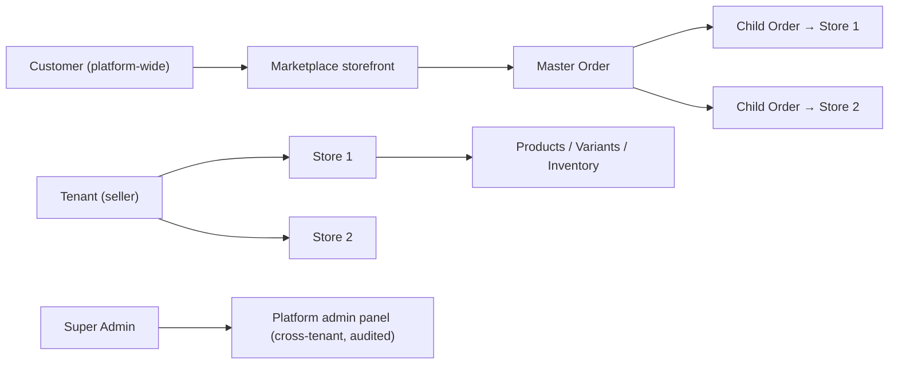
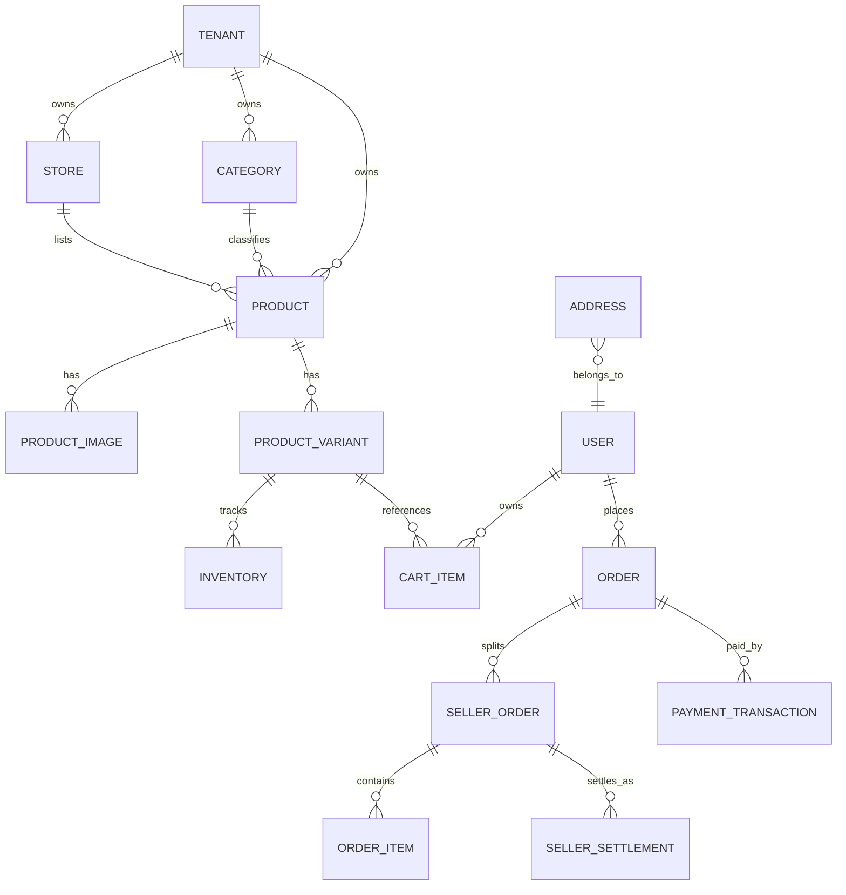

# MarketHub — Phase 1 Technical Specification (Core Marketplace)

## 1. Executive Summary

Phase 1 delivers a multi-tenant marketplace SaaS where tenants register, create stores, publish products (with categories, variants, inventory, images), and where customers register, browse a unified marketplace, add to cart, and check out across **multi-store carts** (master order + seller child orders) with basic payment processing. Seller and Super Admin dashboards close the loop.

**Stack:** Laravel 11 (API-first, JSON:API-ish REST), Angular 17+ (standalone components), MySQL 8 / PostgreSQL 15, queue (database/Redis), S3-compatible storage.

---

## 2. Scope & Assumptions

**In scope (MVP):** everything listed in Phase 1. **Out of scope (Phase 2+):** payouts automation, commissions engine tuning, coupon engine, reviews, multi-currency, custom domains, mobile apps, analytics warehouse.

| # | Assumption | Trade-off if wrong |
|---|---|---|
| A1 | Single currency, single locale per marketplace instance | Add currency table + FX later; affects orders/payments |
| A2 | Platform admin owns the marketplace; tenants are sellers (B2C multi-vendor model, not tenant-per-customer-storefront) | If tenants run own branded storefronts (SaaS-style), add subdomain/domain routing + per-tenant theming |
| A3 | Payment provider is abstracted; MVP uses one gateway (e.g., Stripe/PayPal/local PSP) behind an interface | Swapping is config-level; webhook logic per driver |
| A4 | Guest checkout **disabled** in MVP (customer registration required) | If enabled: add guest tokens + order claim flow |
| A5 | Sellers ship their own orders; platform is not the merchant of record logistics party | If platform-managed delivery: add delivery personnel module (Phase 2) |
| A6 | Refunds in MVP = full refund via gateway API, manual approval by admin/seller | Partial/refund lines = Phase 2 |
| A7 | Tenancy via shared DB, single schema, `tenant_id` scoping (row-level isolation) | DB-per-tenant only if data residency demands it — higher ops cost |

**Key architectural decisions:**

1. **Tenancy:** shared DB + global scope on `tenant_id`, enforced in Eloquent (BelongsToTenant trait) **and** policy layer. No cross-tenant queries without explicit platform-admin authorization.
2. **Multi-store cart:** cart items reference *stores*; checkout splits into **one master order + N seller child orders**; payment captured once at master level, settlements tracked per child.
3. **Payments:** `PaymentGateway` interface → `capture`, `refund`, `verifyWebhook`; all sensitive data never stored; webhooks signature-verified + idempotent.
4. **API-first:** Angular consumes the same REST API as any future mobile client; Sanctum token auth (SPA cookie mode for web).

---

## 3. Tenancy & Isolation Model



| Dimension | Rule |
|---|---|
| Ownership | `tenant_id` on: stores, products, categories (tenant-owned trees), product_images, variants, inventory, orders (child), order_items |
| Query scoping | Global Eloquent scope + repository guard; integration tests assert leak-free queries |
| Unique constraints | Always tenant-scoped: `UNIQUE(tenant_id, store_id, sku)`, `UNIQUE(tenant_id, slug)` |
| Auth policies | Laravel Policies per resource; sellers only ever see own tenant rows |
| Cross-tenant access | Super Admin only, via `impersonation`/admin endpoints, every action audit-logged |
| Files/images | Per-tenant S3 prefixes `tenants/{id}/products/...`; signed URLs |
| Cache/jobs | Cache keys prefixed `t:{tenant_id}:`; queued jobs carry tenant context (serialized) |
| Exports/logs | Export jobs scoped by tenant; logs never include PII beyond IDs |

---

## 4. Data Model (Phase 1 Core)



### Tables (key fields; illustrative SQL)

| Table | Key fields | Notes / constraints |
|---|---|---|
| `tenants` | id, name, slug (unique), status (pending/active/suspended), owner_user_id, payout_details_id | status gates store/product publishing |
| `users` | id, email (unique), password, phone, role scope, email_verified_at | Separate tables or type column for staff vs customers — recommend **single `users` + `user_roles` pivot** |
| `user_roles` | user_id, role, tenant_id NULL | role: super_admin, tenant_owner, store_staff, customer; tenant_id NULL = platform-level |
| `stores` | id, tenant_id, name, slug, status (draft/active/suspended), currency, tax_inclusive bool, delivery_fee, delivery_days | `UNIQUE(tenant_id, slug)` |
| `categories` | id, tenant_id, parent_id NULL, name, slug, position | Tenant-scoped tree; `UNIQUE(tenant_id, parent_id, slug)` |
| `products` | id, tenant_id, store_id, category_id, name, slug, description, status (draft/active/archived), price (base), tax_class, has_variants | `UNIQUE(tenant_id, store_id, slug)`; index (tenant_id, status, category_id) |
| `product_images` | id, product_id, path, position, is_primary | FK cascade |
| `product_variants` | id, product_id, sku, options JSON (`{"size":"M","color":"red"}`), price_override NULL, weight, status | `UNIQUE(tenant_id, sku)` |
| `inventories` | id, tenant_id, variant_id, quantity int, reserved int, low_stock_threshold | optimistic lock via `version` or `SELECT…FOR UPDATE` on decrement |
| `carts` / `cart_items` | cart_id, user_id, store_id, variant_id, qty, unit_price snapshot | price resolved at add-time, **re-validated at checkout** |
| `orders` (master) | id, user_id, subtotal, delivery_total, tax_total, grand_total, currency, status, shipping_address_id, placed_at | status: pending_payment→paid→partially_fulfilled→fulfilled→completed / cancelled / refunded |
| `seller_orders` | id, order_id, tenant_id, store_id, subtotal, delivery_fee, commission, net_settlement, status | status: awaiting_fulfillment→processing→shipped→delivered→cancelled |
| `order_items` | id, seller_order_id, variant_id, product name/sku/price snapshot, qty, line_tax | immutable snapshots |
| `payment_transactions` | id, order_id, gateway, gateway_ref, amount, status (initiated/succeeded/failed/refunded), idempotency_key, raw_webhook_id | `UNIQUE(gateway, gateway_ref)` |
| `seller_settlements` | id, seller_order_id, gross, commission, delivery_fee, refund_amount, net, status (pending/released) | computed at order state transitions |
| `webhook_events` | id, gateway, event_id (unique), payload, processed_at | idempotency anchor |
| `audit_logs` | id, actor_user_id, tenant_id, action, subject_type/id, diff JSON, ip | append-only |

Indexes: `orders(user_id, created_at)`, `seller_orders(tenant_id, status, created_at)`, `products(tenant_id, store_id, status)`, full-text/search index on product name (see §6).

**Lifecycle — seller_order state machine:**
`awaiting_fulfillment → processing → shipped → delivered → completed`; cancel allowed only before `shipped`; refund via master order coordination.

---

## 5. REST API Surface (Phase 1)

Auth: Bearer/Sanctum. Errors: RFC 7807-style `{ "error": { "code", "message", "fields" } }`. Pagination: `?page`, `?per_page` with `meta` envelope. All seller endpoints require tenant context from authenticated user's role.

| Area | Endpoint | Method | Auth / Authz |
|---|---|---|---|
| Auth | `/api/auth/register`, `/api/auth/login`, `/api/auth/logout`, `/api/auth/me` | POST/POST/POST/GET | public / public / token / token |
| Tenant | `/api/tenants/register`, `/api/tenant` (GET/PATCH), `/api/tenant/stores` CRUD | POST, GET/PATCH, CRUD | public; tenant_owner |
| Categories | `/api/tenant/categories` CRUD | CRUD | tenant_owner, store_staff (read/write per policy) |
| Products | `/api/tenant/products` (list/create), `/api/tenant/products/{id}` (get/patch/delete) | CRUD | tenant-scoped policy |
| Variants | `/api/tenant/products/{id}/variants` CRUD | CRUD | same |
| Images | `/api/tenant/products/{id}/images` POST (multipart), DELETE, PATCH reorder | CRUD | same |
| Inventory | `/api/tenant/variants/{id}/inventory` GET/PATCH; low-stock report | GET/PATCH | same |
| Marketplace | `/api/market/products` (search, filter by category/store/price, sort), `/api/market/stores`, `/api/market/products/{slug}` | GET | public |
| Cart | `/api/cart` GET, `/api/cart/items` POST/PATCH/DELETE | — | customer |
| Checkout | `/api/checkout/quote` (totals preview), `/api/checkout` POST (idempotency key required) | POST | customer |
| Orders | `/api/orders` (customer), `/api/orders/{id}`, `/api/orders/{id}/cancel` | GET/POST | customer |
| Seller orders | `/api/tenant/orders` list/filter, `/api/tenant/orders/{id}/status` transitions | GET/PATCH | tenant_owner/staff |
| Payments | `/api/payments/intent/{orderId}` POST, `/api/payments/webhook/{gateway}` POST | POST | customer / public+signature |
| Seller dashboard | `/api/tenant/dashboard/summary` (sales, orders, low stock) | GET | tenant |
| Admin | `/api/admin/tenants` (approve/suspend), `/api/admin/orders`, `/api/admin/metrics`, `/api/admin/audit-logs` | GET/PATCH | super_admin, all audited |

**Checkout example (idempotent):**

```http
POST /api/checkout
Idempotency-Key: 9f1c0a7e-...
{
  "shipping_address_id": 42,
  "cart_token": "current"
}
```

```json
{
  "order": { "id": 1001, "status": "pending_payment", "grand_total": "157.50", "currency": "USD" },
  "seller_orders": [ { "id": 2001, "store_id": 7, "subtotal": "100.00" },
                     { "id": 2002, "store_id": 9, "subtotal": "57.50" } ],
  "payment": { "type": "redirect", "url": "https://gateway.example/…" }
}
```

Validation rules (samples): qty ≥ 1 and ≤ inventory available; address belongs to user; idempotency key replays prior response (Redis, 24h TTL).

---

## 6. Search & Marketplace

MVP: MySQL `FULLTEXT` (or PostgreSQL `tsvector`) on `products.name + description`, filters: category, store, price range, status=active only; sort: relevance/price/newest; pagination cursor for scale. Phase 2: Meilisearch/Algolia when > ~100k SKUs. **Tenant isolation in search:** index only `status=active` products; marketplace search is cross-tenant by design (that's the marketplace), tenant dashboards search within own tenant only.

---

## 7. Payments Abstraction

```php
interface PaymentGateway {
    PaymentIntentResult createIntent(Order $order, Money $amount): PaymentIntentResult;
    ?WebhookResult verifyAndParse(WebhookRequest $req): ?WebhookResult; // signature verified
    RefundResult refund(PaymentTransaction $tx, Money $amount): RefundResult;
}
```

- Never store card data; gateway token/redirect only.
- Webhook endpoint: verify signature → insert `webhook_events` (unique event_id = idempotency) → process in queue → update order/transaction.
- Failure handling: `pending_payment` expiry job (e.g., 30 min) releases reserved inventory.
- Inventory reservation: decrement-and-reserve inside DB transaction at checkout; release on payment failure/cancel.
- Reconciliation job: nightly compare `payment_transactions` vs gateway settlement report (Phase 1: alert-only).
- Refunds: admin/seller approves → gateway refund → child order → `refunded`; settlement adjusted.

---

## 8. RBAC Matrix (least privilege)

| Capability | Super Admin | Tenant Owner | Store Staff | Customer |
|---|---|---|---|---|
| Approve/suspend tenants | ✅ | — | — | — |
| Cross-tenant data view (audited) | ✅ | — | — | — |
| Manage own stores/products/inventory | — | ✅ | ✅ (assigned store) | — |
| Fulfil own orders / view own settlements | — | ✅ | ✅ (read) | — |
| Marketplace browse, cart, checkout, own orders | browse | browse | browse | ✅ |

---

## 9. Dashboards (Angular screens, Phase 1)

| Screen | Key elements | States (loading/empty/error) |
|---|---|---|
| Marketplace | Search bar, category nav, product grid, store pages | skeleton loaders; "no results" with filters reset |
| Cart/Checkout | Per-store grouping, totals breakdown (items/delivery/tax), address select, pay | invalid qty errors; payment failure retry |
| Customer orders | Status timeline, cancel (if eligible), reorder | empty state |
| Seller dashboard | KPIs (today sales, open orders, low stock), order fulfil queue, product CRUD, variant matrix editor, image uploader (drag-drop, progress) | onboarding empty states |
| Super Admin | Tenant approval queue, GMV/orders metrics, audit log viewer | tenant-suspended states |

Angular: standalone components + signals, route guards per role, interceptors for tenant-scoped API and RFC7807 errors, design tokens (spacing/color/typography), WCAG 2.1 AA (focus order, labels, contrast), responsive ≥360px.

---

## 10. Security & Launch Checklist

- [ ] Rate limiting (login, register, checkout, search) — Laravel throttler
- [ ] Authorization policy tests asserting **zero cross-tenant leakage** (negative tests per endpoint)
- [ ] Webhook signature verification + idempotency tests
- [ ] No secrets in frontend; CSP, CORS restricted to app origin
- [ ] Audit logging on all admin + seller mutations
- [ ] Backups (daily full + PITR), monitoring (error tracking, queue depth, webhook lag alerts)
- [ ] PII minimization; encrypted at rest; TLS everywhere
- [ ] Payment provider PCI responsibility documented (SAQ-A scope)

---

## 11. Delivery Order (suggested build sequence)

1. Auth + tenancy skeleton (global scopes, policies, tests) → 2. Tenant registration/stores → 3. Categories/products/variants/images/inventory → 4. Marketplace + search → 5. Cart → 6. Checkout (order split, reservation) → 7. Payment abstraction + webhooks → 8. Seller order fulfilment + dashboards → 9. Super Admin → 10. Hardening checklist.

---

Want me to expand any artifact next — e.g., full migration SQL, OpenAPI spec for the checkout/order endpoints, or UI-generation prompts for the Angular screens? If your model differs from assumptions A2/A4/A6 (storefront-per-tenant SaaS, guest checkout, partial refunds), tell me and I'll adjust the spec accordingly.